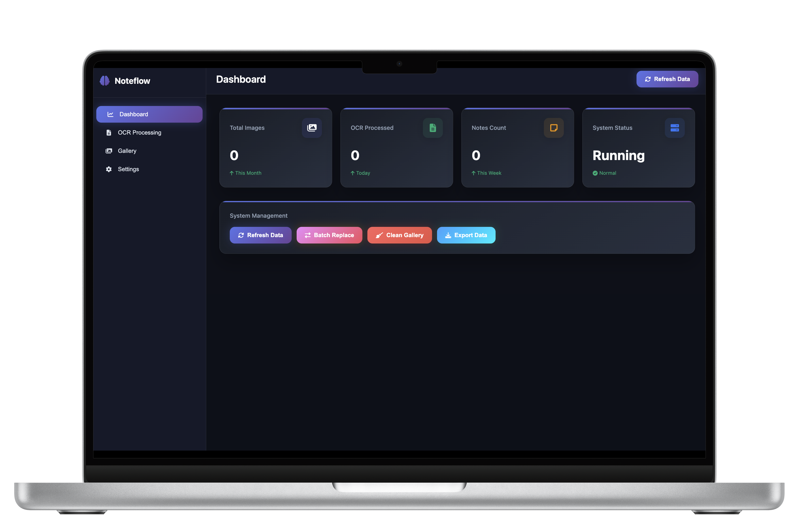

# NoteFlow 

[English](README.md) | [中文文档](README.zh-CN.md)

[](https://opensource.org/licenses/MIT)
[](https://nodejs.org/)
[](https://www.typescriptlang.org/)



**NoteFlow** 是一个 **安全、基于 Web 的笔记同步与 OCR 系统**。  
它支持将本地 Markdown 笔记直接同步到 **GitHub 或自建服务器**，自动将本地图片替换为 **图床外链**，并将手写笔记批量识别为结构化 Markdown（含 **数学公式识别**），同时按 **时间 / 主题** 自动归类。

---

## ✨ 功能特点

-  **数据自主** — 直接同步到 GitHub 或自建服务器，不依赖第三方。
-  **通用 Markdown** — 兼容 Obsidian、Typora、Logseq 等任意 Markdown 平台。
-  **手写 → Markdown** — 基于 GLM-4.5V 的 OCR，引擎支持 LaTeX 风格公式。
-  **智能归档** — 按 **时间** 与 **主题** 自动整理文件与目录。
-  **图床集成** — 本地图片自动替换为外链，便于跨端分享与长期备份。
-  **批量处理** — 一次上传多张图片，自动并行处理。
-  **实时预览与编辑** — 现代化 UI，所见即所得 Markdown 渲染。
-  **Git 集成** — 自动提交、版本管理、冲突感知与处理建议。

---

##  快速开始

### 环境依赖
- Node.js 18+
- Python 3.7+（用于静态文件服务）
- GitHub Personal Access Token
- SiliconFlow API Key

### 安装

```bash
# 克隆仓库
git clone https://github.com/yourusername/noteflow.git
cd noteflow

# 安装后端依赖
cd backend
npm install

# 配置环境变量
cp ../.env.example ../.env
# 编辑 .env，填入你的 API Keys
````

### 运行

```bash
# 方式 1：启动脚本（推荐）
./start-all.sh

# 方式 2：手动启动
# 后端（端口 8788）
cd backend
node real-server.cjs

# 前端（端口 8080）
python3 -m http.server 8080
```

### 访问

* **管理面板** → [http://localhost:8080/admin-dashboard.html](http://localhost:8080/admin-dashboard.html)
* **手写 OCR** → [http://localhost:8080/handwriting-archive.html](http://localhost:8080/handwriting-archive.html)

---

##  使用流程

1. **上传** 手写图片或 Markdown 文件
2. **OCR + 格式化** → 转为 Markdown（支持数学公式）
3. **校对** → 在实时预览编辑器中修改
4. **保存 & 同步** → 自动提交到 GitHub / 推送到服务器
5. **分享与备份** → 图床外链 + Git 历史，跨端可读、长期可靠

---

##  配置说明

### `.env` 文件

```env
# 必需
SILICONFLOW_API_KEY=your_siliconflow_api_key
GITHUB_TOKEN=your_github_personal_access_token

# 可选
CLOUDFLARE_ACCOUNT_ID=your_cloudflare_account_id
CLOUDFLARE_API_TOKEN=your_cloudflare_api_token
```

* **SiliconFlow API** → 前往 siliconflow\.cn 获取 Key
* **GitHub Token** → 创建具有 `repo` 权限的 Personal Access Token
* **Cloudflare**（可选）→ 用于高级图片管理

---

##  项目结构

```
├── backend/                 # Node.js/TypeScript 后端
│   ├── src/
│   │   ├── providers/       # 外部服务集成
│   │   ├── routes/          # API 路由
│   │   ├── services/        # 业务逻辑
│   │   └── types.ts         # 类型定义
│   └── real-server.cjs      # 主服务文件
├── docs/                    # 文档
├── admin-dashboard.html     # 管理界面
└── handwriting-archive.html # OCR 主界面
```

---

##  贡献

欢迎贡献代码！请参阅 [docs/CONTRIBUTING.md](docs/CONTRIBUTING.md)。

---

##  许可证

基于 **MIT 协议** 开源 — 详见 [LICENSE](LICENSE)。

---

## 💬 支持

* [文档](docs/)
* [问题反馈](https://github.com/twis06/NoteFlow/issues)
* [讨论区](https://github.com/twis06/NoteFlow/discussions)

